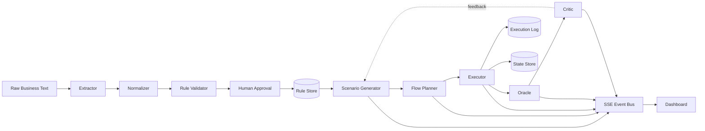
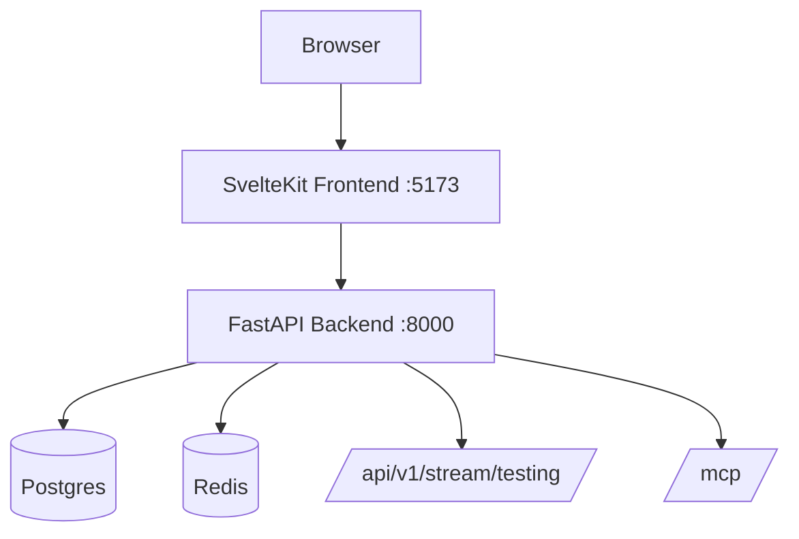

# InvariantFlow


Multi-agent API validation swarm that converts business rules into executable checks, runs them against API flows, and streams live verdicts to a real-time dashboard.

Quick links: [Quick Start](#quick-start-docker-recommended) | [Run A Test](#run-a-test-swarm) | [Key Endpoints](#key-api-endpoints) | [Architecture](#architecture)

## Why InvariantFlow

- Ingest raw policy text and convert it into structured rules.
- Execute with `direct`, `blackboard`, or `langgraph` orchestration.
- Evaluate outcomes with Oracle + Critic feedback loops.
- Enforce cost caps while preserving useful coverage.
- Observe everything live through SSE and dashboard panels.

## Architecture



## Runtime Stack



## Quick Start (Docker Recommended)

1. Clone the repository.
```bash
git clone https://github.com/RahimTS/InvariantFlow.git
cd InvariantFlow
```

2. Create `.env` from the template.
```bash
cp .env.example .env
```
PowerShell alternative:
```powershell
copy .env.example .env
```

3. Optionally add your OpenRouter key in `.env`.
```env
OPENROUTER_API_KEY=your_key_here
```

4. Start everything.
```bash
docker compose up --build
```

5. Open the services.
- Dashboard: `http://localhost:5173`
- API docs: `http://localhost:8000/docs`
- MCP endpoint: `http://localhost:8000/mcp`

6. Stop the stack.
```bash
docker compose down
```

## Local Development

### Backend

```bash
uv sync
uv run uvicorn app.main:app --reload
```

### Frontend

```bash
cd frontend
npm install
npm run dev
```

### URLs

- API docs: `http://localhost:8000/docs`
- Frontend: `http://localhost:5173`

## Run A Test Swarm

```bash
curl -X POST http://localhost:8000/api/v1/testing/run \
  -H "Content-Type: application/json" \
  -d '{"mode":"blackboard","seed_starter":true,"entity":"Shipment"}'
```

### Modes

- `direct`: deterministic linear run.
- `blackboard`: task-board driven orchestration.
- `langgraph`: graph loop with critic feedback.

## SSE Event Envelope

```json
{
  "event_type": "TASK_POSTED",
  "timestamp": "2026-03-30T10:00:00Z",
  "data": {}
}
```

Legacy payloads may include `event` instead of `event_type`.

## Key API Endpoints

### Testing

- `POST /api/v1/testing/run`
- `GET /api/v1/testing/runs`
- `GET /api/v1/testing/runs/{run_id}`
- `GET /api/v1/testing/tasks/dead`

### Tasks

- `GET /api/v1/tasks/dead`

### Rules

- `GET /api/v1/rules/pending`
- `POST /api/v1/rules/{rule_id}/approve`
- `POST /api/v1/rules/{rule_id}/reject`
- `GET /api/v1/rules/{rule_id}`
- `GET /api/v1/rules/{rule_id}/history`

### Ingestion

- `POST /api/v1/ingestion/ingest`

### Protocols and Streams

- `GET /api/v1/stream/testing`
- `GET /api/v1/agui/stream`
- `GET /.well-known/agent-card.json`
- `GET /api/v1/agents/status`
- `GET /api/v1/mcp/tools`
- `POST /api/v1/mcp/call`
- `GET /mcp`

## Backend-Only Image

Build:
```bash
docker build -t invariantflow-backend .
```

Run on `8000`:
```bash
docker run -d -p 8000:8000 invariantflow-backend
```

Run on custom port (example `5477`):
```bash
docker run -d -e APP_PORT=5477 -p 5477:5477 invariantflow-backend
```

## Quality Checks

```bash
uv run pytest -q
uv run ruff check app
cd frontend && npm run check
```

## Project Layout

```text
app/
  agents/              # ingestion + testing agents
  api/                 # FastAPI routers
  memory/              # local + Postgres/Redis stores
  runtime/             # run registry + event helpers
  schemas/             # Pydantic models
frontend/
  src/routes/          # SvelteKit pages
  src/lib/             # API client, stores, components

ARCHITECTURE.md        # full architecture details
PHASE_V2.md            # phase implementation spec
```