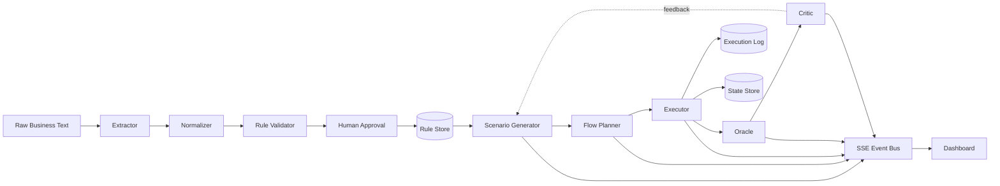
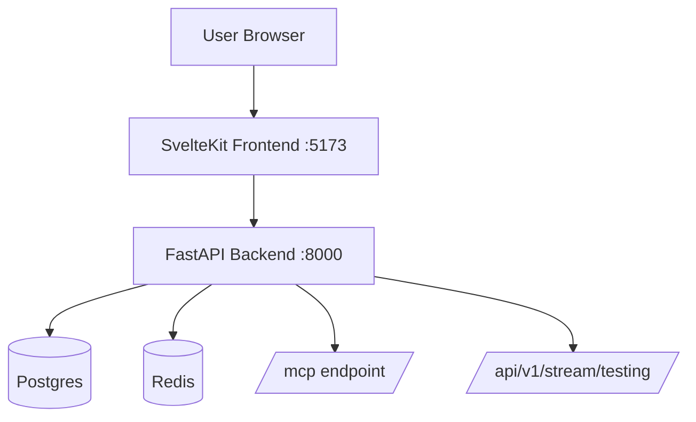

# InvariantFlow

InvariantFlow is a multi-agent API validation swarm: it ingests business rules, generates scenarios, executes API flows, and determines whether backend behavior matches policy.

## What You Get

- Rule ingestion pipeline (`extractor -> normalizer -> validator -> human approval`)
- Three testing execution modes (`direct`, `blackboard`, `langgraph`)
- Deterministic Oracle with LLM fallback for non-parsable conditions
- Critic feedback loop with cost limits and diminishing-return stop conditions
- Live SSE stream for task flow, execution steps, verdicts, and agent state
- SvelteKit dashboard for real-time observability
- Docker stack with Postgres + Redis + backend + frontend

## System Architecture



## Runtime Stack (Docker Mode)



## Quick Start (Recommended: Docker)

1. Clone and enter project:
```bash
cd "D:\2026\Personal Projects\InvariantFlow"
```

2. Create env file:
```bash
copy .env.example .env
```

3. (Optional) Add OpenRouter key in `.env`:
```env
OPENROUTER_API_KEY=your_key_here
```

4. Build and run full stack:
```bash
docker compose up --build
```

5. Open:
- Frontend dashboard: `http://localhost:5173`
- Backend docs: `http://localhost:8000/docs`
- MCP endpoint: `http://localhost:8000/mcp`

6. Stop:
```bash
docker compose down
```

## Local Development (Without Docker)

### Backend

```bash
uv sync
uv run uvicorn app.main:app --reload
```

### Frontend

```bash
cd frontend
npm install
npm run dev
```

### Open

- Backend: `http://localhost:8000/docs`
- Frontend: `http://localhost:5173`

## Run a Test Swarm

Use API docs (`/docs`) or call directly:

```bash
curl -X POST http://localhost:8000/api/v1/testing/run \
  -H "Content-Type: application/json" \
  -d '{"mode":"blackboard","seed_starter":true,"entity":"Shipment"}'
```

Supported `mode` values:
- `direct`: linear deterministic pipeline
- `blackboard`: task-board driven pipeline
- `langgraph`: critic loop with iteration controls

## Key Endpoints

- `POST /api/v1/ingestion/ingest`
- `GET /api/v1/rules/pending`
- `POST /api/v1/rules/{rule_id}/approve`
- `POST /api/v1/testing/run`
- `GET /api/v1/testing/runs`
- `GET /api/v1/stream/testing`
- `GET /.well-known/agent-card.json`
- `GET /mcp`

## Backend-Only Docker Image

Build:
```bash
docker build -t invariantflow-backend .
```

Run default (`8000`):
```bash
docker run -d -p 8000:8000 invariantflow-backend
```

Run custom port (example `5477`):
```bash
docker run -d -e APP_PORT=5477 -p 5477:5477 invariantflow-backend
```

## Testing & Lint

```bash
uv run pytest -q
uv run ruff check app
```

## Project Layout

```text
app/
  agents/              # ingestion + testing agents
  api/                 # FastAPI routers
  memory/              # local + Postgres/Redis stores
  runtime/             # run registry + event envelope helpers
  schemas/             # Pydantic contracts
frontend/              # SvelteKit dashboard

ARCHITECTURE.md        # full architecture spec
PHASE_V2.md            # phase V2 implementation spec
```
